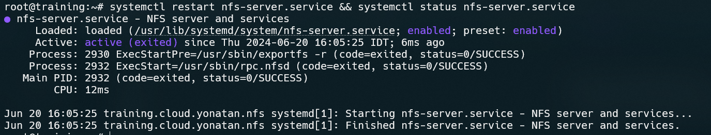
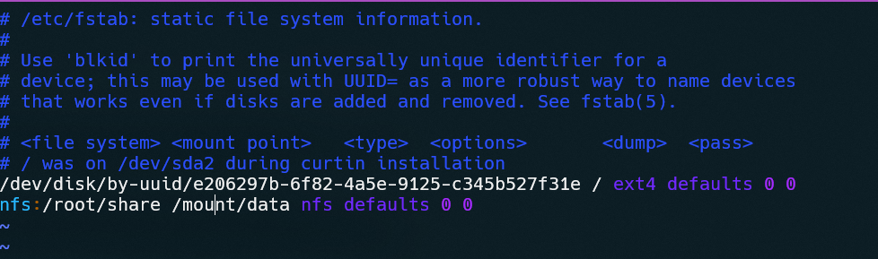

# Setup nfs server

## Server side
### Install nfs server
```
apt update && apt install nfs-kernel-server -y
```


### Create the folder to share
```
mkdir <Path_To_Share_Folder>
```

### export the nfs server
```
vi /etc/exports
```
```
<Path_To_Share_Folder> <Client_Server_IP>(rw,sync,no_subtree_check)
```


### Restart the NFS service
```
systemctl restart nfs-server.service && systemctl status nfs-server.service
```


### Check that the share folder as been exported
```
exportfs -v
```


## Client Side
### Install nfs client
```
apt update && apt install nfs-common -y
```


### Create a directory on the client machine where you want to mount the NFS share
```
sudo mkdir -p <Path_To_Mount_Point>
```


### Mount the nfs volume
```
mount <nfs_server_ip>:<remote_path> <Path_To_Mount_Point>
```


### To make the mount persistent across reboots, add an entry to the /etc/fstab
```
vi /etc/fstab
```
```
<nfs_server_ip>:<remote_path> <Path_To_Mount_Point> nfs defaults 0 0 
```



### Run the following command to mount all file Systems specified in /etc/fstab
```
mount -a
```
